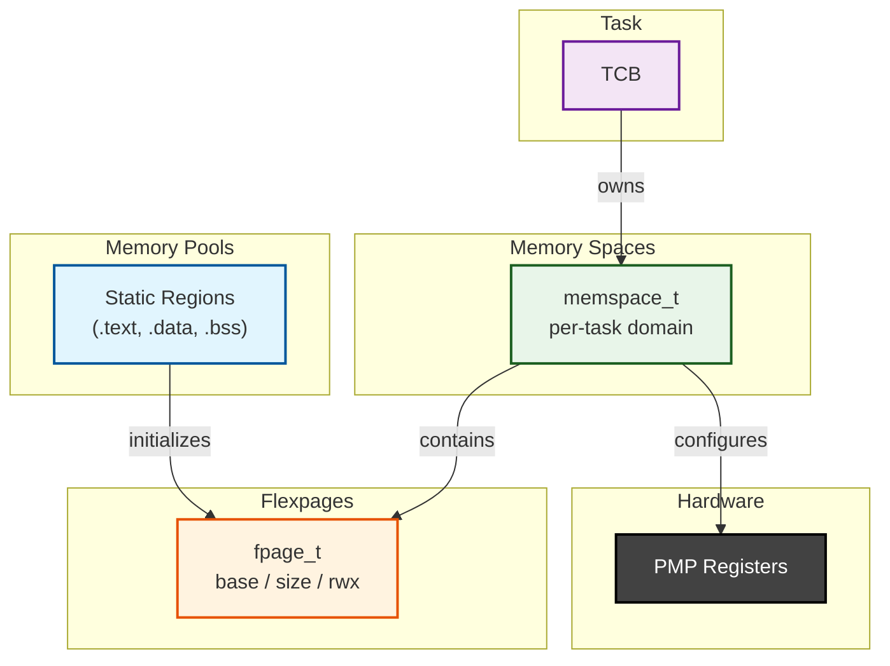
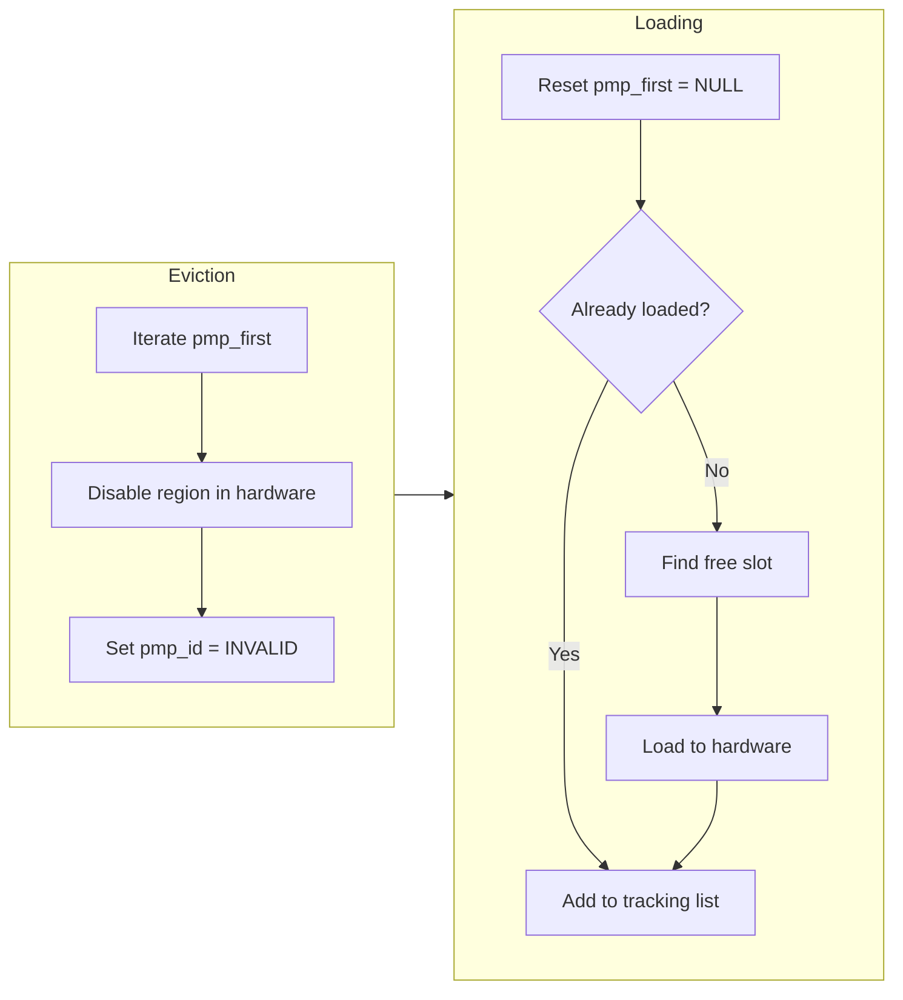
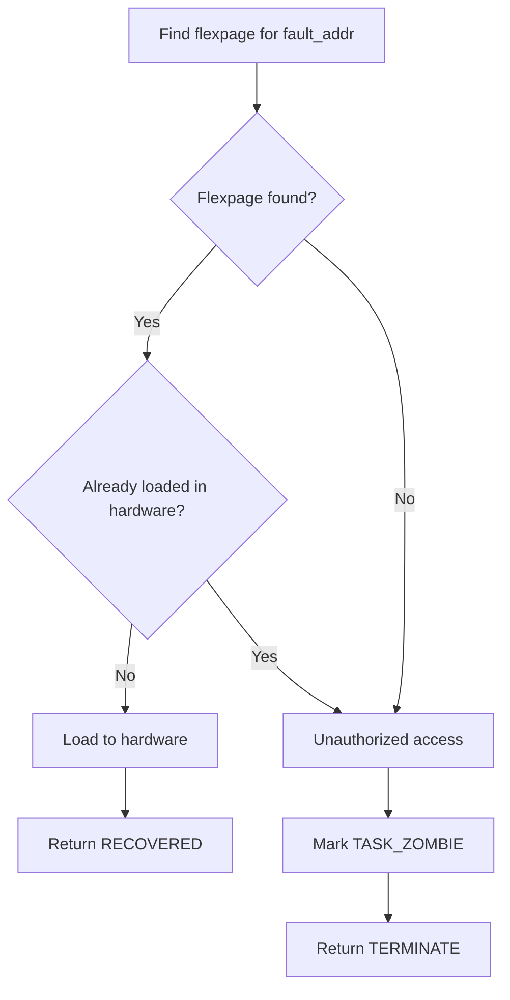

# PMP: Memory Protection

## Overview

Linmo operates entirely in Machine mode by default, with all tasks sharing the same physical address space.
A misbehaving task can corrupt kernel data structures or interfere with other tasks, compromising system stability.

Physical Memory Protection provides hardware-enforced access control at the physical address level.
Unlike an MMU, PMP requires no page tables or TLB management, making it suitable for resource-constrained RISC-V systems.
PMP enforces read, write, and execute permissions for up to 16 configurable memory regions.

The design draws inspiration from the F9 microkernel, adopting a three-layer abstraction:
- **Memory Pools** define static physical regions at boot time, derived from linker symbols.
- **Flexpages** represent dynamically protected memory ranges with associated permissions.
- **Memory Spaces** group flexpages into per-task protection domains.

## Architecture

### Memory Abstraction Layers



The core structures:

```c
typedef struct fpage {
    struct fpage *as_next;  /* Next in address space list */
    struct fpage *map_next; /* Next in mapping chain */
    struct fpage *pmp_next; /* Next in PMP queue */
    uint32_t base;          /* Physical base address */
    uint32_t size;          /* Region size */
    uint32_t rwx;           /* R/W/X permission bits */
    uint32_t pmp_id;        /* PMP region index */
    uint32_t flags;         /* Status flags */
    uint32_t priority;      /* Eviction priority */
    int used;               /* Usage counter */
} fpage_t;
```
```c
typedef struct memspace {
    uint32_t as_id;          /* Memory space identifier */
    struct fpage *first;     /* Head of flexpage list */
    struct fpage *pmp_first; /* Head of PMP-loaded list */
    struct fpage *pmp_stack; /* Stack regions */
    uint32_t shared;         /* Shared flag */
} memspace_t;
```

### TOR Mode and Paired Entries

TOR (Top Of Range) mode defines region *i* as `[pmpaddr[i-1], pmpaddr[i])`.
This works well for contiguous kernel regions where boundaries naturally chain together.

For dynamically allocated user regions at arbitrary addresses, Linmo uses paired entries:

```
┌─────────────────────────────────────────┐
│ Entry N:   base_addr  (disabled)        │
│ Entry N+1: top_addr   (TOR, R|W)        │
│                                         │
│ Region N+1 = [base_addr, top_addr)      │
└─────────────────────────────────────────┘
```

The first entry sets the lower bound with permissions disabled.
The second entry defines the upper bound with TOR mode and the desired permissions.
This consumes two hardware slots per user region but allows non-contiguous regions at arbitrary addresses.

### Kernel and User Regions

Kernel regions protect `.text`, `.data`, and `.bss` sections:

```c
static const mempool_t kernel_mempools[] = {
    DECLARE_MEMPOOL("kernel_text",
                    &_stext, &_etext,
                    PMPCFG_PERM_RX,
                    PMP_PRIORITY_KERNEL),
    DECLARE_MEMPOOL("kernel_data",
                    &_sdata, &_edata,
                    PMPCFG_PERM_RW,
                    PMP_PRIORITY_KERNEL),
    DECLARE_MEMPOOL("kernel_bss",
                    &_sbss, &_ebss,
                    PMPCFG_PERM_RW,
                    PMP_PRIORITY_KERNEL),
};
```

Kernel heap and stack are intentionally excluded—PMP is ineffective for M-mode, and kernel heap/stack is only used in M-mode.
This keeps Regions 0-2 for kernel, leaving Region 3+ available for user dynamic regions with correct TOR address ordering.

Kernel regions use a hybrid lock strategy:

| Lock Type | Location                  | Effect                  |
|-----------|---------------------------|-------------------------|
| Software  | `regions[i].locked = 1`   | Allocator skips slot    |
| Hardware  | `PMPCFG_L` NOT set        | M-mode access preserved |

Setting the hardware lock bit would deny M-mode access.

User regions protect task stacks and are dynamically loaded during context switches.
When PMP slots are exhausted, user regions can be evicted and reloaded on demand.

## Memory Isolation

### Context Switching

Context switching reconfigures PMP in two phases:



**Eviction phase** iterates the outgoing task's `pmp_first` linked list.
Each flexpage is disabled in hardware, and `pmp_id` is set to `PMP_INVALID_REGION (0xFF)` to mark it as unloaded.

**Loading phase** rebuilds `pmp_first` from scratch.
This prevents circular references—if `pmp_first` is not cleared, reloading a flexpage could create a self-loop in the linked list.
For each flexpage in the incoming task's memory space:
- **Already loaded** (shared regions): Add directly to tracking list
- **Not loaded**: Find a free slot via `find_free_region_slot()` and load

If all slots are occupied, remaining regions load on-demand through the fault handler (lazy loading).

### Per-Task Kernel Stack

U-mode trap handling requires a kernel stack to save context.
If multiple U-mode tasks share a single kernel stack, Task A's context frame is overwritten when Task B traps—the ISR writes to the same position on the shared stack.

Linmo allocates a dedicated 512-byte kernel stack for each U-mode task:

```c
typedef struct tcb {
    /* ... */
    void *kernel_stack;       /* Base address of kernel stack (NULL for M-mode) */
    size_t kernel_stack_size; /* Size of kernel stack in bytes (0 for M-mode) */
} tcb_t;
```

M-mode tasks do not require a separate kernel stack—they use the task stack directly without privilege transition.

During context switch, the scheduler saves the incoming task's kernel stack top to a global variable.
The ISR restore path loads this value into `mscratch`, enabling the next U-mode trap to use the correct per-task kernel stack.

### Fault Handling and Task Termination

PMP access faults occur when a U-mode task attempts to access memory outside its loaded regions.
The trap handler routes these faults to the PMP fault handler, which attempts recovery or terminates the task.

The fault handler first searches the task's memory space for a flexpage containing the faulting address.
If found and the flexpage is not currently loaded in hardware, it loads the region and returns to the faulting instruction.
This enables lazy loading—regions not loaded during context switch are loaded on first access.

If no matching flexpage exists, the access is unauthorized (e.g., kernel memory or another task's stack).
If the flexpage is already loaded but still faulted, recovery is impossible.
In either case, the handler marks the task as `TASK_ZOMBIE` and returns a termination code.



The trap handler interprets the return value:

| Return Code             | Action                                        |
|-------------------------|-----------------------------------------------|
| `PMP_FAULT_RECOVERED`   | Resume execution at faulting instruction      |
| `PMP_FAULT_TERMINATE`   | Print diagnostic, invoke dispatcher           |
| `PMP_FAULT_UNHANDLED`   | Fall through to default exception handler     |

Terminated tasks are not immediately destroyed.
The dispatcher calls a cleanup routine before selecting the next runnable task.
This routine iterates zombie tasks, evicts their PMP regions, frees their memory spaces and stacks, and removes them from the task list.
Deferring cleanup to the dispatcher avoids modifying task structures from within interrupt context.

## Best Practices

### Hardware Limitations

PMP provides 16 hardware slots shared between kernel and user regions.
Kernel regions occupy slots 0-2 and cannot be evicted.
Each user region requires two slots (paired entries for TOR mode).

| Resource                    | Limit                      |
|-----------------------------|----------------------------|
| Total PMP slots             | 16                         |
| Kernel slots                | 3 (fixed at boot)          |
| Slots per user region       | 2 (paired entries)         |
| Max concurrent user regions | 6 (13 ÷ 2)                 |

With only 6 concurrent user regions, systems spawning many U-mode tasks rely on lazy loading through the fault handler.
This incurs runtime overhead as regions are dynamically reloaded during context switches.
Applications with many concurrent U-mode tasks should consider this tradeoff between isolation granularity and performance.

### Task Creation Guidelines

U-mode tasks receive automatic PMP protection.
The kernel allocates a memory space and registers the task stack as a protected flexpage.

Applications use `mo_task_spawn()`, which automatically creates tasks in the appropriate privilege mode based on the build configuration:

```c
/* Standard usage - automatically inherits parent's privilege mode */
mo_task_spawn(task_func, stack_size);
```

Privileged applications may need explicit control over task privilege modes, such as when testing mixed-privilege scheduling or implementing system services that manage both trusted and isolated tasks.
For these scenarios, use the explicit creation functions:

```c
/* Explicitly create M-mode task: trusted code, full memory access */
mo_task_spawn_kernel(task_func, stack_size);

/* Explicitly create U-mode task: isolated execution, PMP protected */
mo_task_spawn_user(task_func, stack_size);
```

Choose the appropriate privilege level:
- **M-mode**: Trusted kernel components requiring unrestricted memory access
- **U-mode**: Application tasks where memory isolation is desired

### Common Pitfalls

1. Assuming PMP protects the kernel

    PMP only restricts Supervisor and User modes.
    Machine mode has unrestricted access regardless of PMP configuration.
    This is intentional—the kernel must access all memory to manage protection.

    ```c
    /* This code in M-mode bypasses PMP entirely */
    void kernel_func(void) {
        volatile uint32_t *user_stack = (uint32_t *)0x80007000;
        *user_stack = 0;  /* No fault—M-mode ignores PMP */
    }
    ```

    PMP protects user tasks from each other but does not protect the kernel from itself.

2. Exhausting PMP slots

    With only ~6 user regions available, spawning many U-mode tasks causes PMP slot exhaustion.
    Subsequent tasks rely entirely on lazy loading, degrading performance.

3. Mixing M-mode and U-mode incorrectly

    M-mode tasks spawned with `mo_task_spawn()` do not receive memory spaces.
    PMP-related functions check for NULL memory spaces and return early, so calling them on M-mode tasks has no effect.

## References

- [RISC-V Privileged Architecture](https://riscv.github.io/riscv-isa-manual/snapshot/privileged/)
- [Memory Protection for Embedded RISC-V Systems](https://nva.sikt.no/registration/0198eb345173-b2a7ef5c-8e7e-4b98-bd3e-ff9c469ce36d)
